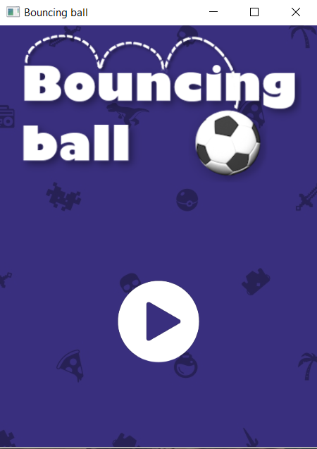
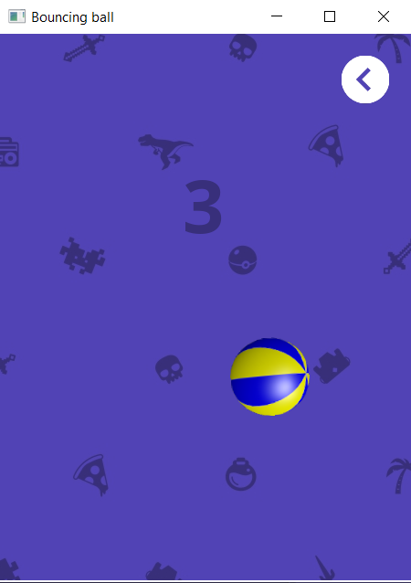

# SFML-Bouncing-ball-game

    /* //////////////////////////////////////////////////////////////////////////////////
    *   Bouncing ball game created from scratch with SFML 2.5.1 library
    *   One of my first game projects, created in 2019 with ugly code, rewrited in 07.20
    *   Hopefully its understandable and little better coded now
    * ///////////////////////////////////////////////////////////////////////////////////
    *       Author:  Pawel Mlynarz
    *////////////////////////////////////////////////////////////////////////////////////

# Description 
    
    Just a simple game which let me learn some basic features of SFML library.
    In this project i haven't used delta time to handle animations and moves yet.
    However i got basic knowledge about physics and moving objects smoothly, to get it nice looking.
    
# How to do anything 

    1. Download release floder
    2. Run *.exe file
    3. Have fun :)

# ScreenShots

